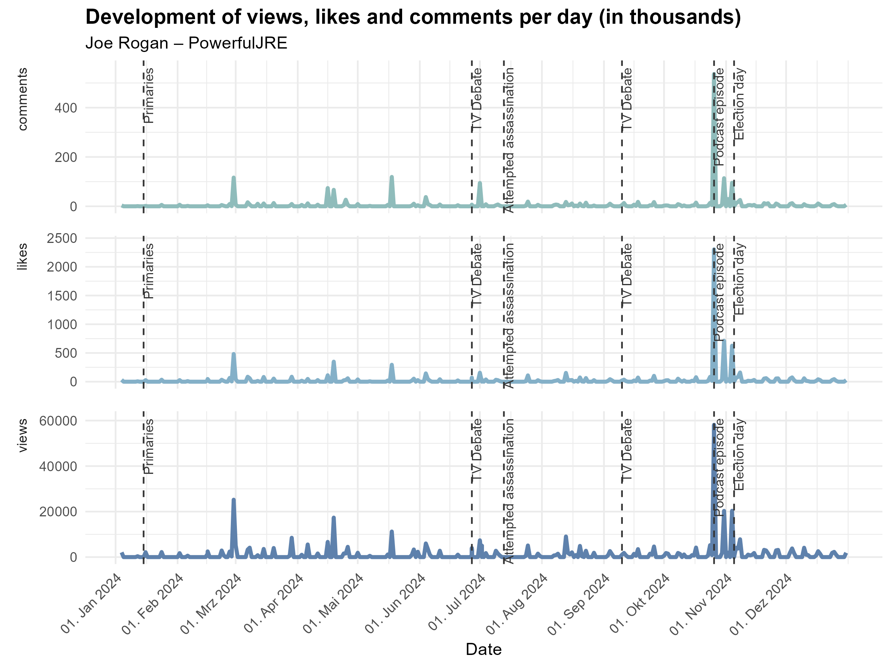
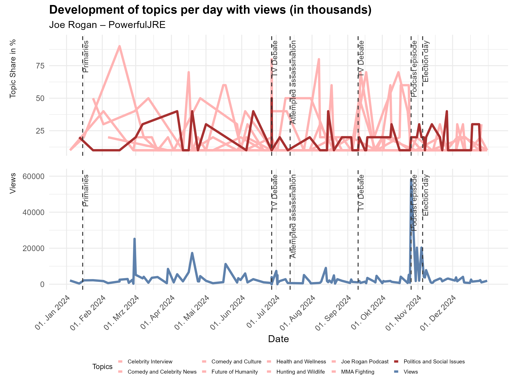
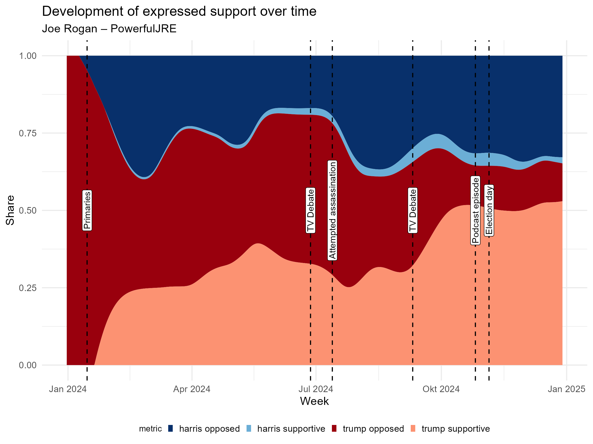

## A Selection of my Projects

At this point, I would like to present a few of my data science projects, which range from data collected via smartphone tracking, NLP analysis, the use of LLMs for text classification, working with social media data, and teaching and learning materials.

### The deciding factor in the 2024 US election?

US election campaigns are known for their close results, at least in terms of the popular vote. Donald Trump's re-election in November 2024 is no exception.

The election campaign was eventful and characterised by the high relevance of social media. In this context, one of the biggest American podcasts – the Joe Rogan Experience – provided a relevant platform, which Donald Trump utilised.

Over the next few minutes, we would like to take a closer look at the podcast Joe Rogan Experience, or more specifically, its YouTube account.

::: {.callout-tip collapse="true"}
## Who is Joe Rogan?
Joe Rogan is an American podcaster, MMA commentator and comedian who runs the very popular podcast The Joe Rogan Experience. He has repeatedly spoken out on political issues and declared his support for Donald Trump ahead of the last US election. In the past, he had supported Bernie Sanders, among others.
:::

When we look at the popularity metrics of the podcast's YouTube account, we see a massive increase in views for the podcast episode with Donald Trump, as well as relatively stable view figures for the rest of the year.


This raises the question of who actually benefited from whom. While Joe Rogan generally achieved high viewing figures with other guests as well, the podcast episode with Donald Trump seems to be an absolute exception. The high popularity of this episode so shortly before the election could indicate either a highly mobilised Trump following eager to hear their candidate speak. An alternative explanation would be that the episode was watched by undecided voters who wanted to inform themselves before making their imminent voting decision. Based on our data, we cannot conclusively determine which of these two explanations is correct.

However, the pure view figures do not tell us anything about what was actually discussed, i.e. what the preferred topics of conversation are in the podcast episodes. To find this out, I automatically transcribed the conversations using a BERTopic model, which assigns thematically similar text passages to each other. This allows overarching topics of conversation, such as ‘politics and society’, to be identified.


Here it becomes clear that political and social issues were discussed at regular intervals in the podcasts. 

However, the question remains whether Joe Rogan and his guests expressed support for either of the two presidential candidates. To answer this question, the transcribed conversations were automatically analysed using LLM and the results were visually presented.


The plot clearly shows a shift in support for Donald Trump as a presidential candidate. While at the beginning of the year the attitudes expressed in the podcast were rather negative towards Trump, this changed to a supportive stance shortly before the election.

However, it remains unclear to what extent this can be attributed to the podcast or whether the podcast is more a reflection of American society at that time.

Against this backdrop, we can say that Joe Rogan's podcast episode featuring Donald Trump as a guest shortly before election day was extremely popular. Furthermore, the data shows that there was a predominantly supportive attitude towards Donald Trump in the second half of the year. However, it is impossible to say conclusively whether this was really the decisive factor in the election result, and it seems rather unlikely.

::: {.callout-tip collapse="true"}

## R-Code
```{r, eval=FALSE}
# load library
library(dplyr)
library(tidyr)
library(quanteda)
library(reticulate)
library(jsonlite)
library(lubridate)
library(stringr)
library(nord)
library(ggplot2)
library(httr)
library(jsonlite)
library(klaus)
library(ggplot2)
library(ggstream)
```
**Data collection**
```{r, eval=FALSE}
use_condaenv("snake1", required = TRUE)  

# Python Version
py_config()

# youtube api key 
yt_key = Sys.getenv("yt_key")

# key to python 
py_run_string(sprintf("API_KEY = '%s'", yt_key))

# check
py_run_string("print(API_KEY)")
```

```{python, eval=FALSE}
from googleapiclient.discovery import build
from youtube_transcript_api import YouTubeTranscriptApi
from youtube_transcript_api._errors import TranscriptsDisabled, NoTranscriptFound
import json

# === CONFIG ===
CHANNEL_ID = 'UCzQUP1qoWDoEbmsQxvdjxgQ'  # PowerfulJRE

# === INITIATE YOUTUBE CLIENT ===
youtube = build('youtube', 'v3', developerKey=API_KEY)

# === Get video IDs ===
def get_video_ids(channel_id, max_results=1000):
    video_ids = []
    next_page_token = None

    published_after = '2024-01-01T00:00:00Z'
    published_before = '2024-12-31T23:59:59Z'

    while len(video_ids) < max_results:
        request = youtube.search().list(
            part='id',
            channelId=channel_id,
            maxResults=min(50, max_results - len(video_ids)),
            order='date',
            pageToken=next_page_token,
            publishedAfter=published_after,
            publishedBefore=published_before,
            type='video'
        )
        response = request.execute()
        for item in response['items']:
            video_ids.append(item['id']['videoId'])

        next_page_token = response.get('nextPageToken')
        if not next_page_token:
            break

    return video_ids

# === Get meta data ===
def get_video_metadata(video_ids):
    metadata_list = []
    for i in range(0, len(video_ids), 50):  # max 50 pro Request
        request = youtube.videos().list(
            part='snippet,contentDetails,statistics',
            id=','.join(video_ids[i:i+50])
        )
        response = request.execute()
        for item in response['items']:
            metadata = {
                'video_id': item['id'],
                'title': item['snippet']['title'],
                'published_at': item['snippet']['publishedAt'],
                'duration': item['contentDetails']['duration'],
                'views': item['statistics'].get('viewCount'),
                'likes': item['statistics'].get('likeCount'),
                'comments': item['statistics'].get('commentCount')
            }
            metadata_list.append(metadata)
    return metadata_list

# === Get transcripts ===
def get_transcript(video_id):
    try:
        transcript_list = YouTubeTranscriptApi.get_transcript(video_id)
        transcript_text = " ".join([entry['text'] for entry in transcript_list])
        return transcript_text
    except (TranscriptsDisabled, NoTranscriptFound):
        return None

# === Run functions ===
def main():
    print("Hole Video-IDs...")
    video_ids = get_video_ids(CHANNEL_ID)
    print(f"{len(video_ids)} Video-IDs gefunden.")

    print("Hole Metadaten...")
    videos = get_video_metadata(video_ids)

    print("Hole Transkripte...")
    for video in videos:
        print(f"Transkript für {video['title'][:30]}...")
        video['transcript'] = get_transcript(video['video_id'])

    # Speichere in JSON-Datei
    with open('powerfuljre_videos_2024.json', 'w', encoding='utf-8') as f:
        json.dump(videos, f, ensure_ascii=False, indent=2)

    print("Fertig! Daten gespeichert in 'powerfuljre_videos_2024.json'")

if __name__ == '__main__':
    main()
```


```{r, eval=FALSE}
yt_videos = fromJSON("powerfuljre_videos_2024.json", flatten = TRUE)
df_videos = as.data.frame(yt_videos)

# function: ISO-8601 Duration convert to minutes
convert_duration_to_minutes = function(duration_str) {
  # Extrahiere Stunden, Minuten, Sekunden mit Regex
  h = as.numeric(str_match(duration_str, "PT(\\d+)H")[,2])
  m = as.numeric(str_match(duration_str, "H?(\\d+)M")[,2])
  s = as.numeric(str_match(duration_str, "M?(\\d+)S")[,2])
  
  h[is.na(h)] = 0
  m[is.na(m)] = 0
  s[is.na(s)] = 0
  
  total_minutes  <- h * 60 + m + s / 60
  return(total_minutes)
}

df_videos = df_videos %>% 
  mutate(
    duration_in_min = convert_duration_to_minutes(duration),
    # wenn wir schon dabei sind, passen wir noch ein paar formate an
    published_at = as_datetime(published_at),
    views = as.numeric(views),
    likes = as.numeric(likes),
    comments = as.numeric(comments)
  ) %>%
  arrange(published_at) %>% # Sortiere nach Datum
  mutate(video_index = row_number())  # Nummeriere Videos

saveRDS(df_videos, file = "yt_rogan.rds")
```
**YouTube Metrics**

```{r, eval=FALSE}
df_videos = readRDS(file = "yt_rogan.rds")
plot_data = df_videos %>%
  select(published_at, views, likes, comments) %>%
  mutate(
    date = as.Date(published_at)
    ) %>%
  pivot_longer(cols = c(views, likes, comments), names_to = "metric", values_to = "value") %>%
  mutate(
    value_in_tausend = value / 1000
    ) %>% 
  complete(
    date = seq.Date(min(date), as.Date("2024-12-31"), by = "day"),
    metric,
    fill = list(value_in_tausend = 0)
  )

events = data.frame(
  x = as.Date(c(
    "2024-01-15", "2024-06-27", "2024-07-13",
    "2024-09-10", "2024-10-26", "2024-11-05"
  )),
  label = c(
    "Primaries", "TV Debate", "Attempted assassination", 
    "TV Debate", "Podcast episode", "Election day"
  )
)

annotation_df = expand.grid(metric = unique(plot_data$metric), x = events$x) %>%
  left_join(events, by = "x") %>%
  left_join(
    plot_data %>%
      group_by(metric) %>%
      summarise(y = max(value_in_tausend, na.rm = TRUE) * 1.05),  # etwas Puffer
    by = "metric"
  )


plot_metrics = ggplot(plot_data, aes(x = date, y = value_in_tausend, color = metric)) +
  geom_line(size = 1.2, show.legend = FALSE) +
  scale_color_nord("frost") +
  facet_grid(metric ~ ., scales = "free_y", switch = "y") +
  labs(
    title = "Development of views, likes and comments per day (in thousands)",
    subtitle = "Joe Rogan – PowerfulJRE",
    x = "Date",
    y = NULL
  ) +
  theme_minimal(base_size = 11) +
  theme(
    strip.text.y = element_text(angle = 0, hjust = 1),
    axis.text.x = element_text(angle = 45, hjust = 1),
    plot.title = element_text(face = "bold"),
    strip.placement = "outside",
    panel.spacing = unit(1, "lines")
  ) +
  scale_x_date(breaks = seq.Date(as.Date("2024-01-01"), as.Date("2024-12-31"), by = "month"), 
               date_labels = "%d. %b %Y") +
  # Vertikale Linien (weiterhin global, das ist ok)
  geom_vline(xintercept = as.Date(c(
    "2024-01-15", "2024-06-27", "2024-07-13", 
    "2024-09-10", "2024-10-26", "2024-11-05"
  )), linetype = "dashed", color = "#333333") +
  # Pro-Facet Annotationen
  geom_text(
    data = annotation_df,
    aes(x = x, y = y, label = label),
    inherit.aes = FALSE,
    color = "#333333",
    size = 3,
    angle = 90,
    hjust = 1,
    vjust = 1
  )
plot_metrics

ggsave("joe_rogan_metrics.png", plot_metrics, width = 20, height = 15, units = "cm")
```
**Topics**
```{r, eval=FALSE}
yt_videos = readRDS(file = "yt_rogan.rds")

py$texts_for_bert = yt_videos %>% 
  select(video_id, transcript) 
```

```{python, eval=FALSE}
from nltk.tokenize import sent_tokenize

# Video-Transkript in 10 Einheiten aufteilen 
unit_docs = []
video_map = []

for idx, row in texts_for_bert.iterrows():
    transcript = row["transcript"]
    
    if not isinstance(transcript, str) or not transcript.strip():
        continue
    
    words = transcript.split()
    total_words = len(words)
    chunk_size = total_words // 10 if total_words >= 10 else total_words

    for i in range(10):
        start = i * chunk_size
        end = (i + 1) * chunk_size if i < 9 else total_words  # letzter Chunk nimmt den Rest
        chunk = " ".join(words[start:end])
        if len(chunk.strip()) > 0:
            unit_docs.append(chunk)
            video_map.append(row["video_id"])

from sklearn.feature_extraction.text import CountVectorizer
from nltk.corpus import stopwords

# hinzufügen von weiteren sprachlichen stopwörter
spoken_stopwords = [
    "yeah", "like", "you know", "i mean", "right", "so", "well", "okay", "uh", "um",
    "sort of", "kind of", "actually", "basically", "literally", "you see", "you guys",
    "gonna", "gotta", "wanna", "ain't", "cuz", "cause", "huh", "hmm", "alright", "know", 
    "__", "people", "think", "going"
]

english_stop_words = stopwords.words("english") + spoken_stopwords

from nltk.tokenize import sent_tokenize
from nltk.corpus import stopwords

from sentence_transformers import SentenceTransformer
from hdbscan import HDBSCAN
from sklearn.feature_extraction.text import CountVectorizer
from bertopic import BERTopic
import pandas as pd

# SentenceTransformer-Modell (multilingual)
sentence_model = SentenceTransformer("paraphrase-multilingual-mpnet-base-v2")

# HDBSCAN-Clusterer
hdbscan_model = HDBSCAN(
    min_cluster_size=30,
    metric="euclidean",
    cluster_selection_method="eom",
    prediction_data=True
)

# CountVectorizer für Englisch
vectorizer_model = CountVectorizer(stop_words=english_stop_words)

# Embeddings vorab berechnen (schneller, stabiler)
docs_embeddings = sentence_model.encode(unit_docs, show_progress_bar=True)

# BERTopic mit allen Custom-Komponenten
topic_model = BERTopic(
    embedding_model=sentence_model,
    hdbscan_model=hdbscan_model,
    vectorizer_model=vectorizer_model,
    calculate_probabilities=True,
    n_gram_range=(1, 2),
    top_n_words=30,
    language="english",
    verbose=True
)

# Modelltraining
topics, probabilities = topic_model.fit_transform(unit_docs, embeddings=docs_embeddings)

n_clusters = len(set(topic_model.hdbscan_model.labels_)) - (1 if -1 in topic_model.hdbscan_model.labels_ else 0)
print(f"Anzahl der Cluster (ohne Outlier): {n_clusters}")

# Ergebnis-Zuordnung zu Video-Units
df_units = pd.DataFrame({
    "units": unit_docs,
    "video_id": video_map,
    "topic": topics
})

# Die eindeutigsten Begriffe pro Topic anhängen
def get_distinctive_words(tid, n=5):
    if tid == -1:
        return "Outlier"
    return ", ".join([word for word, _ in topic_model.get_topic(tid)[:n]])

df_units["distinctive_words"] = df_units["topic"].apply(lambda tid: get_distinctive_words(tid, n=5))

# Die Docs anhängen, welche das Topic am besten repräsentieren
topic_representatives = topic_model.get_representative_docs()

def get_representative_docs(tid, n=5):
    if tid == -1:
        return "Outlier"
    reps = topic_representatives.get(tid, [])
    return reps[:n] if reps else []
  
df_units["rep_docs"] = df_units["topic"].apply(
    lambda tid: " ||| ".join(get_representative_docs(tid, n=5))
)
```

```{r, eval=FALSE}
units = py$df_units

topics = units %>% 
  select(topic, distinctive_words, rep_docs) %>% 
  distinct()

prompt = "I will give you information about a topic extracted from a BERTopic model.

For each topic, you will receive:
1. A list of the most distinctive terms (words or phrases that are important for the topic).
2. Five representative text snippets (short documents or segments that belong to this topic).

Your task is:
- To analyze the distinctive terms and the example snippets.
- To generate a short, descriptive, and human-readable label that summarizes what the topic is about.
- The label should ideally be 2–5 words long, use plain language, and reflect the actual content as represented in the texts.

Please return the corresponding label and the associated confidence scores in JSON format. Do not add any further information."

# Define your API endpoint and key
url = "https://chat-ai.academiccloud.de/v1/chat/completions"
key = Sys.getenv("chat_ai_key")

# Define your headers
headers = c(
 "Accept" = "application/json",
 "Authorization" = paste0("Bearer ", key),
 "Content-Type" = "application/json"
)

# Loop through your news articles and classify them
classifications = vector("list", length(topics$topic))
for (i in seq_along(topics$topic)) {
 # Define your body with the current news article and prompt
 body = list(
 model = "meta-llama-3.1-70b-instruct",
 messages = list(
 list(role = "system", content = "You are a helpful language expert and topic modeling assistant."),
 list(role = "user", content = paste0(prompt, "\n\n", topics$distinctive_words[i], "\n\n", topics$rep_docs[i]))
 ),
 temperature = 0.2
 )

 # Send the request and parse the response
 response = POST(url, add_headers(.headers = headers), body = toJSON(body, auto_unbox = TRUE))
 response_parsed = fromJSON(content(response, as = "text", encoding = "UTF-8"))

 # Store the classification result
 classifications[[i]] = response_parsed$choices$message$content

 # Print the current status
 cat(paste0("Topic number ", i, " of ", length(topics$topic), " is finished coding.\n"))
}

# Convert the list to a dataframe
clean_json = function(json_str) {
  # Entferne mögliche Markdown-Formatierung wie ```json ... ```
  gsub("^```json|```$", "", json_str) |> trimws()
}

topic_labels = data.frame(
  topic = topics$topic,
  classifications = sapply(classifications, function(x) {
    json_clean = clean_json(x)
    fromJSON(json_clean, simplifyVector = TRUE)$label
  }),
  confidence_score = sapply(classifications, function(x) {
    json_clean = clean_json(x)
    fromJSON(json_clean, simplifyVector = TRUE)$confidence
  })
)

units_with_labels = units %>% 
  left_join(topic_labels, by = "topic") %>% 
  left_join(yt_videos, by = "video_id") %>% 
  select(video_id, title, published_at, duration_in_min, views, likes, comments, topic, classifications, confidence_score)

# Zähle Topics pro Video
topic_counts = units_with_labels %>%
  filter(topic >= 0) %>%
  group_by(video_id, published_at, classifications) %>%
  summarise(count = n(), .groups = "drop")

#  Zähle gesamt pro Video (für Anteil-Berechnung)
total_counts = units_with_labels %>%
  group_by(video_id, published_at) %>%
  summarise(total = n(), .groups = "drop")

# Berechne Views pro Video
views_data = yt_videos %>%
  mutate(
    date = as.Date(published_at),
    views_in_tsd = as.numeric(views) / 1000
  ) %>%
  select(video_id, date, views_in_tsd)

# Bereite Topic-Share-Daten auf
topic_shares = topic_counts %>%
  left_join(total_counts, by = c("video_id", "published_at")) %>%
  mutate(
    share = count / total,
    date = as.Date(published_at),
    metric = "share",
    value = share * 100,  # in Prozent
    line_color = ifelse(classifications == "Politics and Society", "highlight", "other"),
    facet_group = "Topic Share in %"
  )

# Bereite Views-Daten in passendem Format
views_long = views_data %>%
  mutate(
    metric = "views_in_tsd",
    value = views_in_tsd,
    line_color = NA,  # keine Farbdifferenzierung für Views
    classifications = NA,
    facet_group = "Views"
  )

# Kombiniere beide Datensätze
plot_topics = topic_shares %>% 
  bind_rows(views_long) %>%
  select(date, video_id, classifications, metric, share, value, line_color, facet_group) %>% 
  mutate(
    value = ifelse(metric == "share", share * 100, value),
    classifications = ifelse(facet_group == "Views", "Views", classifications)
  )

# Stelle sicher, dass alle Tage abgedeckt sind (mit 0-Werten auffüllen)
plot_topics = plot_topics %>%
  complete(
    date = seq.Date(min(date, na.rm = TRUE), as.Date("2024-12-31"), by = "day"),
    metric,
    fill = list(value = 0)
  )

events = data.frame(
  x = as.Date(c(
    "2024-01-15", "2024-06-27", "2024-07-13",
    "2024-09-10", "2024-10-26", "2024-11-05"
  )),
  label = c(
    "Primaries", "TV Debate", "Attempted assassination", 
    "TV Debate", "Podcast episode", "Election day"
  )
)

annotation_df = expand.grid(
  facet_group = unique(plot_topics$facet_group),
  metric = unique(plot_topics$metric),
  x = events$x
) %>%
  left_join(events, by = "x") %>%
  left_join(
    plot_topics %>%
      group_by(metric, facet_group) %>%
      summarise(y = max(value, na.rm = TRUE) * 1.05, .groups = "drop"),
    by = c("metric", "facet_group")
  ) %>% 
  filter(!is.na(facet_group))

plot_topics = plot_topics %>% 
  filter(!is.na(classifications))

ggplot_topics = ggplot(plot_topics, aes(x = date, y = value, color = classifications)) +
  geom_line(size = 1.2, show.legend = TRUE) +
  
  # Eigene Farben: Nur US Politics and Society & Views betonen
  scale_color_manual(
    values = c(
      "Politics and Social Issues" = "#a73030",  
      "Views" = "#5e81ac",              
      # Default für andere Topics: Hellgrau
      setNames(rep("#FFB3B3", length(setdiff(unique(plot_topics$classifications), 
                                                c("Politics and Social Issues", "views_in_tsd")))), 
               setdiff(unique(plot_topics$classifications), 
                       c("Politics and Social Issues", "views_in_tsd")))
    )
  ) +
  
  facet_grid(facet_group ~ ., scales = "free_y", switch = "y") +
  labs(
    title = "Development of topics per day with views (in thousands)",
    subtitle = "Joe Rogan – PowerfulJRE",
    x = "Date",
    y = NULL,
    color = "Topics"
  ) +
  theme_minimal(base_size = 11) +
  theme(
    strip.text.y = element_text(angle = 0, hjust = 1),
    axis.text.x = element_text(angle = 45, hjust = 1),
    plot.title = element_text(face = "bold"),
    strip.placement = "outside",
    panel.spacing = unit(1, "lines"),
    legend.text = element_text(size = 6),   
    legend.title = element_text(size = 8),  
    legend.key.size = unit(0.2, "cm"),       
    legend.position = "bottom"               
  ) +
  scale_x_date(
    breaks = seq.Date(as.Date("2024-01-01"), as.Date("2024-12-31"), by = "month"), 
    date_labels = "%d. %b %Y"
  ) +
  
  # Vertikale Ereignislinien
  geom_vline(xintercept = as.Date(c(
    "2024-01-15", "2024-06-27", "2024-07-13", 
    "2024-09-10", "2024-10-26", "2024-11-05"
  )), linetype = "dashed", color = "#333333") +
  
  # Annotationen
  geom_text(
    data = annotation_df,
    aes(x = x, y = y, label = label),
    inherit.aes = FALSE,
    color = "#333333",
    size = 3,
    angle = 90,
    hjust = 1,
    vjust = 1
  )

ggplot_topics
ggsave("joe_rogan_topics.png", ggplot_topics, width = 20, height = 15, units = "cm")
```

**Stance towards candidates**

```{r, eval=FALSE}
general_instructions = "You are a highly accurate and consistent text classification model that specializes in analyzing chunks of English-language Podcasts transcripts. Your task is to classify stances in a sample of Podcasts transcripts. You must strictly follow the classification rules without deviation. Do not return any additional information outside the classification scheme. Use JSON."

formatting_instructions = "Always return a single JSON object for each coded text with the category name as the key. The value should be an object containing a 'label' key and a single value among multiple options. Each JSON object should have the following structure:"

codebook = data.frame(
  category = c("stance_towards_trump", "stance_towards_trump", "stance_towards_trump", "stance_towards_harris", "stance_towards_harris", "stance_towards_harris"), 
  label = c("SUPPORTIVE", "OPPOSED", "NEUTRAL", "SUPPORTIVE", "OPPOSED", "NEUTRAL"), 
  instructions = c("Label the text as SUPPORTIVE if it mentions Donald Trump and expresses support, sympathy, or understanding toward him, his policies, his actions, or associated movements or goals.",
                   "Label the text as OPPOSED if it mentions Donald Trump and expresses criticism or antipathy towards him, his policies, his actions, or associated movements or goals.",
                   "Label the text as NEUTRAL if it mentions Donald Trump and no clear stance is present, or the stance is unclear, ambivalent, ambiguous, or mixed (e.g. by equally presenting contradictory positions).",
                   "Label the text as SUPPORTIVE if it mentions Kamala Harris and expresses support, sympathy, or understanding toward her, her policies, her actions, or associated movements or goals.",
                   "Label the text as OPPOSED if it mentions Kamala Harris and expresses criticism or antipathy towards her, her policies, her actions, or associated movements or goals.",
                   "Label the text as NEUTRAL if it mentions Kamala Harris and no clear stance is present, or the stance is unclear, ambivalent, ambiguous, or mixed (e.g. by equally presenting contradictory positions)."
                   ))

data_to_code = units %>% 
  rename(text = units)

sentiments_candidates = code_content(data_to_code, 
                                     general_instructions, 
                                     formatting_instructions, 
                                     codebook,
                                     provider = "chatai",
                                     model = "meta-llama-3.1-70b-instruct")

saveRDS(sentiments_candidates, file = "sentiment_candidates.rds")

units_with_sentiments = readRDS(file = "sentiment_candidates.rds")
units_with_sentiments = units_with_sentiments %>% 
  left_join(yt_videos, by = "video_id") %>% 
  select(video_id, title, published_at, duration_in_min, views, likes, comments, category, label)

# Zähle Stances pro Video
stance_counts = units_with_sentiments %>%
  filter(label != "NEUTRAL") %>%
  group_by(video_id, published_at, category, label) %>%
  summarise(
    value = n(), 
    .groups = "drop"
    ) %>% 
  mutate(
    metric = paste0(category,"_",label),
    facet_group = "Stance",
    date = as.Date(published_at)
  )

# Berechne Views pro Video
views_data = yt_videos %>%
  mutate(
    date = as.Date(published_at),
    views_in_tsd = as.numeric(views) / 1000
  ) %>%
  select(video_id, date, views_in_tsd)

# Bereite Views-Daten in passendem Format
views_long = views_data %>%
  mutate(
    metric = "views_in_tsd",
    value = views_in_tsd,
    line_color = NA,  # keine Farbdifferenzierung für Views
    classifications = NA,
    facet_group = "Views"
  )

# Kombiniere beide Datensätze und Stelle sicher, dass alle Tage abgedeckt sind (mit 0-Werten auffüllen)
plot_stance = stance_counts %>% 
  bind_rows(views_long) %>%
  select(date, video_id, metric, value, facet_group) %>% 
  complete(
    date = seq.Date(min(date, na.rm = TRUE), as.Date("2024-12-31"), by = "day"),
    metric,
    fill = list(value = 0)
  ) %>% 
  mutate(
    facet_group = ifelse(str_starts(metric, "stance_"),"Stance",facet_group),
    facet_group = ifelse(str_starts(metric, "views_"),"Views",facet_group)
    )

plot_stance_candidates = plot_stance %>% 
  filter(facet_group == "Stance") %>% 
  mutate(
    facet_group = ifelse(str_starts(metric, "stance_towards_trump_"),"Trump",facet_group),
    facet_group = ifelse(str_starts(metric, "stance_towards_harris_"),"Harris",facet_group),
  )

# Splitte die Facet-Gruppen explizit
annotation_df = expand.grid(
  facet_group = unique(plot_stance_candidates$facet_group),
  metric = unique(plot_stance_candidates$metric),
  x = events$x
) %>%
  left_join(events, by = "x") %>%
  left_join(
    plot_stance_candidates %>%
      group_by(facet_group) %>%
      summarise(y = max(value, na.rm = TRUE) * 1.05, .groups = "drop"),
    by = c("facet_group")
  ) 

stance_weekly = plot_stance_candidates %>%
  mutate(week = floor_date(date, "week")) %>%  # Wochendatum
  group_by(week, metric) %>%
  summarise(value = sum(value), .groups = "drop") %>% 
  mutate(
    metric = str_replace(metric, "stance_towards_", ""),
    metric = str_replace(metric, "_", " "),
    metric = tolower(metric)
    )

stance_weekly = stance_weekly %>%
  complete(week = seq(min(week), max(week), by = "week"),
           metric,
           fill = list(value = 0))

farben = c(
  "harris opposed" = "#08306B",    # dunkelblau
  "harris supportive" = "#6BAED6", # hellblau
  "trump opposed" = "#99000D",     # dunkelrot
  "trump supportive" = "#FC9272"   # hellrot
)

plot_stance = ggplot(stance_weekly, aes(x = week, y = value, fill = metric)) +
  geom_stream(type = "proportional") +
  
  # Events als vertikale Linien
  geom_vline(data = events, aes(xintercept = x), 
             linetype = "dashed", color = "black", inherit.aes = FALSE) +
  
  # Beschriftungen mit Label-Kasten und zentriert
  geom_label(data = events, aes(x = x, y = 0.5, label = label),
             inherit.aes = FALSE,
             label.size = 0.2,  # Rahmenlinie dünn
             label.padding = unit(0.15, "lines"),
             fill = "white", color = "black",
             hjust = 0.5, vjust = 0.5, size = 3, angle = 90) +
  
  scale_fill_manual(values = farben) +
  labs(
    title = "Development of expressed support over time",
    subtitle = "Joe Rogan – PowerfulJRE",
    x = "Week",
    y = "Share",
    color = "Stance"
  ) +
  theme_minimal() +
  theme(legend.position = "bottom",
        legend.title = element_text(size = 8),  
        legend.key.size = unit(0.2, "cm")
        )
plot_stance
ggsave("joe_rogan_stances.png", plot_stance, width = 20, height = 15, units = "cm")
```
:::

### Smartphone data 
The processing and visualization of self-tracked smartphone data during a stay in Hamburg. A series of smartphone sensors were used for this, which were recorded using a tracking app and later processed for visualization.


```{r, echo=FALSE, warning=FALSE}
#| column: screen-inset-shaded

# load library
library(leaflet)

# load data
load("data/pre_processed_data")

# run leaflet
leaflet() %>% 
  setView(lng = 9.970424082941788, lat =  53.553692067407596, zoom = 12) %>%
  addTiles() %>% 
  addMarkers(lng = c(gps_data_for_markers$lon),
             lat = c(gps_data_for_markers$lat),
             popup = paste0("<b>", "Location & Interval", "</b><br>", 
                            "Start of the interval: ", gps_data_for_markers$start_date_time, 
                            "<br>", "End of the interval: ", gps_data_for_markers$end_date_time,
                            "<br>", "Activity: ", gps_data_for_markers$activity_type,
                            "<br>", "Share of activity: ", gps_data_for_markers$percentage_activity,
                            "<br>", "Steps: ", gps_data_for_markers$steps,
                            "<br>", "Light: ", gps_data_for_markers$light_description,
                            "<br>", "Share of Light: ", gps_data_for_markers$percentage_light,
                            "<br>", "Weather: ", gps_data_for_markers$weather_description,
                            "<br>", "Clouds: ", gps_data_for_markers$clouds,
                            "<br>", "Temperature in Celsius: ", gps_data_for_markers$temperature,
                            "<br>", "Feels like: ", gps_data_for_markers$feels_like,
                            "<br>", "Humidity in %: ", gps_data_for_markers$humidity,
                            "<br>", "Visibility: ", gps_data_for_markers$visibility,
                            "<br>", "Wind speed in m/s: ", gps_data_for_markers$wind_speed),
                 options = markerOptions()
                 ) %>% 
      addPolylines(
        lng = c(gps_data_for_lines$lon),
        lat = c(gps_data_for_lines$lat),
        color = "darkblue",
        weight = 2,
        opacity = 0.7
      )
```

::: {.callout-tip collapse="true"}

## R-Code
```{r, eval=FALSE}
# load library
library(leaflet)

# load data
load("data/pre_processed_data")

# run leaflet
leaflet() %>% 
  # center map
  setView(lng = 9.970424082941788, lat =  53.553692067407596, zoom = 12) %>%
  # add tiles
  addTiles() %>% 
  # add descriptions
  addMarkers(lng = c(gps_data_for_markers$lon),
             lat = c(gps_data_for_markers$lat),
             popup = paste0("<b>", "Location & Interval", "</b><br>", 
                            "Start of the interval: ", gps_data_for_markers$start_date_time, 
                            "<br>", "End of the interval: ", gps_data_for_markers$end_date_time,
                            "<br>", "Activity: ", gps_data_for_markers$activity_type,
                            "<br>", "Share of activity: ", gps_data_for_markers$percentage_activity,
                            "<br>", "Steps: ", gps_data_for_markers$steps,
                            "<br>", "Light: ", gps_data_for_markers$light_description,
                            "<br>", "Share of Light: ", gps_data_for_markers$percentage_light,
                            "<br>", "Weather: ", gps_data_for_markers$weather_description,
                            "<br>", "Clouds: ", gps_data_for_markers$clouds,
                            "<br>", "Temperature in Celsius: ", gps_data_for_markers$temperature,
                            "<br>", "Feels like: ", gps_data_for_markers$feels_like,
                            "<br>", "Humidity in %: ", gps_data_for_markers$humidity,
                            "<br>", "Visibility: ", gps_data_for_markers$visibility,
                            "<br>", "Wind speed in m/s: ", gps_data_for_markers$wind_speed),
                 options = markerOptions()
                 ) %>% 
      addPolylines(
        lng = c(gps_data_for_lines$lon),
        lat = c(gps_data_for_lines$lat),
        color = "darkblue",
        weight = 2,
        opacity = 0.7
      )
```
:::


### Android App Logs
Together with colleagues from Gesis, I have published a tutorial on the social science processing and analysis of Android app logging data. Android app logs can provide data for social science analysis on the duration of app usage as well as (in some cases) interactions with these apps, such as via push notifications or shares. However, processing the raw data involves a number of minor and major challenges, which we address in this tutorial. Have fun working through it or scrolling through it.

[Tutorial](https://methodshub.gesis.org/library/tutorials/How-to-work-with-Android-App-Logging-Data/1/)
[GitHub](https://github.com/patrickzerrer/How-to-work-with-Android-App-Logging-Data)

**Note:** This page is still a work in progress. I will add more data science projects in the future.

